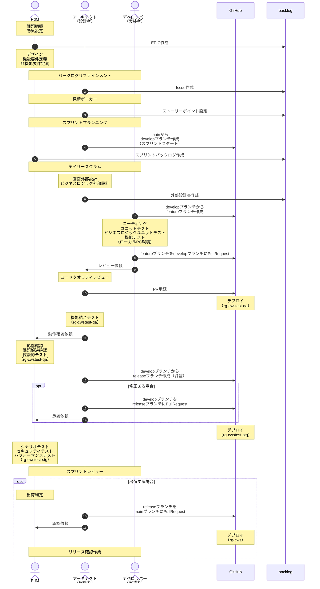

開発フロー、役割分担の整理

```mermaid
sequenceDiagram
    autonumber
    Actor PdM as PdM
    Actor architect as アーキテクト<br>（設計者）
    Actor developer as デベロッパー<br>（実装者）
    Participant GitHub as GitHub
    Participant backlog as backlog

    Note over PdM:課題把握<br>効果設定
    PdM->>backlog:EPIC作成
    Note over PdM:デザイン<br>機能要件定義<br>非機能要件定義
    Note over PdM,developer:バックログリファインメント
    architect->>backlog:Issue作成
    Note over PdM,developer:見積ポーカー
    architect->>backlog:ストーリーポイント設定
    Note over PdM,developer:スプリントプランニング
    architect->>GitHub:mainから<br>developブランチ作成<br>（スプリントスタート）
    PdM->>backlog:スプリントバックログ作成
    Note over PdM,developer:デイリースクラム
    Note over architect:画面外部設計<br>ビジネスロジック外部設計
    architect->>backlog:外部設計書作成
    developer->>GitHub:developブランチから<br>featureブランチ作成
    Note over developer:コーディング<br>ユニットテスト<br>ビジネスロジックユニットテスト<br>機能テスト<br>（ローカルPC環境）
    developer->>GitHub:featureブランチをdevelopブランチにPullRequest
    developer->>architect:レビュー依頼
    Note over architect:コードクオリティレビュー
    architect->>GitHub:PR承認
    Note over GitHub:デプロイ<br>（rg-cwstest-qa）
    Note over architect:機能結合テスト<br>（rg-cwstest-qa）
    architect->>PdM:動作確認依頼
    Note over PdM:影響確認<br>課題解決確認<br>探索的テスト<br>（rg-cwstest-qa）
    architect->>GitHub:developブランチから<br>releaseブランチ作成（終盤）
    opt 修正ある場合
        architect->>GitHub:developブランチを<br>releaseブランチにPullRequest
        architect->>PdM:承認依頼
    end
    Note over GitHub:デプロイ<br>（rg-cwstest-stg）
    Note over PdM:シナリオテスト<br>セキュリティテスト<br>パフォーマンステスト<br>（rg-cwstest-stg）
    Note over PdM,developer:スプリントレビュー
    opt 出荷する場合
        Note over PdM:出荷判定
        architect->>GitHub:releaseブランチを<br>mainブランチにPullRequest
        architect->>PdM:承認依頼
        Note over GitHub:デプロイ<br>（rg-cws）
        Note over PdM,developer:リリース確認作業
    end


```
 
* ビジネスロジックユニットテスト：ビジネスロジック外部設計のパターンテスト（Issue単位） 
* 機能テスト：画面外部設計書のパターンテスト、ビジネスロジックとの疎通テスト（Issue単位） 
* コードクオリティレビュー：コメント、非サポートクラス、命名、ビジネスロジックユニットテストのクオリティ 
* 機能結合テスト：EPIC単位の動的確認
